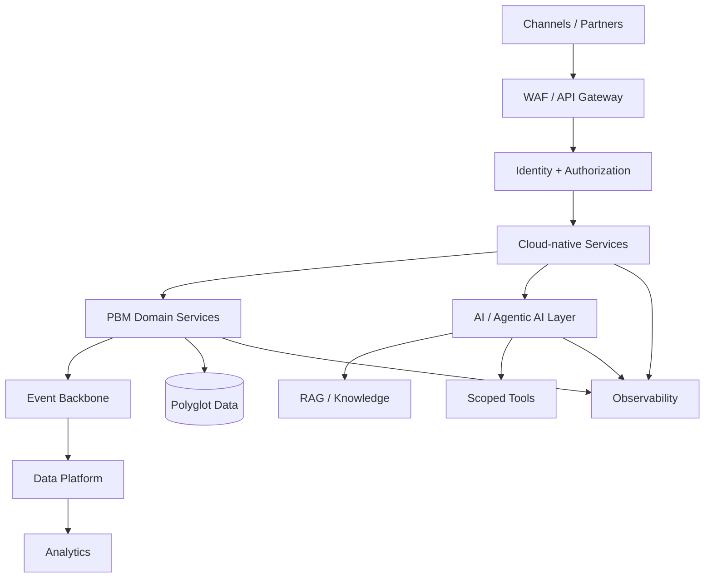

# Cloud-Native PBM Reference Architecture

> Cloud architecture blueprint for modernizing pharmacy/PBM platforms across AWS, Azure, and GCP.

## Executive goal

Create a secure, scalable platform that supports pharmacy benefit workflows while allowing legacy systems to coexist with cloud-native services.

## Architecture

## Cloud mapping

| Capability | AWS | Azure | GCP |
|---|---|---|---|
| Containers | EKS / ECS | AKS | GKE / Cloud Run |
| API | API Gateway | API Management | API Gateway |
| Events | MSK / EventBridge | Event Hubs / Service Bus | Pub/Sub |
| Data warehouse | Redshift | Synapse | BigQuery |
| Object storage | S3 | ADLS | Cloud Storage |
| Secrets | Secrets Manager | Key Vault | Secret Manager |
| AI | Bedrock | Azure AI | Vertex AI |
| Observability | CloudWatch | Azure Monitor | Cloud Operations |

## Modernization principles

1. Establish a cloud landing zone and security perimeter.
2. Identify bounded contexts and seams around legacy systems.
3. Introduce APIs and events before replacing systems of record.
4. Use managed services where they reduce undifferentiated operational work.
5. Introduce AI at governed workflow boundaries.
6. Measure modernization by business outcomes, reliability, and total cost.

## Architecture review checklist

- Identity and least privilege
- Network segmentation
- Data classification
- PHI controls
- Resilience and DR
- API and event contracts
- Cost allocation
- SLOs / SLIs
- Observability
- Operational ownership
- Buy vs build
- Migration sequencing
